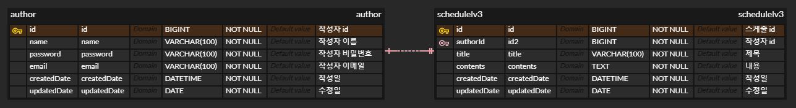

# 📝 스케줄러 만들기

🐥 개발 기간 : 2025.05.11 ~ 2025.05.14

 
 

## ⚙️ 시작 가이드

### ERD

## API 문서
🔗 API 문서(https://documenter.getpostman.com/view/44665083/2sB2jAcUNT)

 
 

## 📌 Lv 1 : 일정 생성 및 조회 (필수)

### 일정 생성 (일정 작성하기)

일정 생성 시, 포함되어야 할 데이터

-    할 일, 작성자명, 비밀번호, 작성일을 저장
-    작성일은 날짜와 시간을 모두 포함한 형태 (예: YYYY-MM-DD HH:MM:SS)
-    각 일정의 고유 식별자(ID)를 자동으로 생성하여 관리
-    최초 입력 시, 수정일은 작성일과 동일

### 전체 일정 조회 (등록된 일정 불러오기)

-    다음 조건을 바탕으로 등록된 일정 목록을 전부 조회
-    수정일 (형식 : YYYY-MM-DD), 작성자명
-    위 조건 중, 한 가지만을 충족하거나, 둘 다 충족을 하지 않을 수도, 두 가지를 모두 충족할 수도 있음
-    수정일 기준 내림차순으로 정렬하여 조회
-    수정일과 작성자명을 입력받는 검색 필드 (각각 또는 둘 다 입력 가능)

선택 일정 조회 (선택한 일정 정보 불러오기)

-    선택한 일정 단건의 정보를 조회
-    일정의 고유 식별자(ID)를 사용하여 조회

## 📌 Lv 2 : 일정 수정 및 삭제 (필수)
### 선택한 일정 수정

-    선택한 일정 내용 중 할 일, 작성자명 만 수정 가능
-    서버에 일정 수정을 요청할 때 비밀번호를 함께 전달
-    작성일은 변경할 수 없으며, 수정일은 수정 완료 시, 수정한 시점으로 변경
-    선택한 일정 삭제

 
 

## 2️⃣ 도전 기능 가이드
## 📌 Lv 3 : 연관 관계 설정 (도전)

작성자와 일정의 연결

설명
-    동명이인의 작성자가 있어 어떤 작성자가 등록한 ‘할 일’인지 구별할 수 없음
-    작성자를 식별하기 위해 이름으로만 관리하던 작성자에게 고유 식별자를 부여
-    작성자를 할 일과 분리해서 관리
-    작성자 테이블을 생성하고 일정 테이블에 FK를 생성해 연관관계를 설정

-    조건
-    작성자는 이름 외에 이메일, 등록일, 수정일 정보를 가지고 있습니다
-    작성자의 정보는 추가로 받을 수 있습니다. (조건만 만족한다면 다른 데이터 추가 가능)
-    작성자의 고유 식별자를 통해 일정이 검색이 될 수 있도록 전체 일정 조회 코드 수정.
-    작성자의 고유 식별자가 일정 테이블의 외래키화

## 📌 Lv 4 : 페이지네이션 (도전)

설명
-    많은 양의 데이터를 효율적으로 표시하기 위해 데이터를 여러 페이지로 나누기
-    페이지 번호와 페이지 크기를 쿼리 파라미터로 전달하여 요청
-    전달받은 페이지 번호와 크기를 기준으로 쿼리를 작성하여 필요한 데이터만을 조회하고 반환

조건
-    등록된 일정 목록을 페이지 번호와 크기를 기준으로 모두 조회
-    조회한 일정 목록에는 작성자 이름이 포함
-    범위를 넘어선 페이지를 요청하는 경우 빈 배열을 반환
-    Paging 객체를 활용할 수 있음

## 📌 Lv 5 : 예외 발생 처리 (도전)
설명
-    예외 상황에 대한 처리를 위해 HTTP 상태 코드와 에러 메시지를 포함한 정보를 사용하여 예외를 관리
-    필요에 따라 사용자 정의 예외 클래스를 생성하여 예외 처리를 수행
-    @ExceptionHandler를 활용하여 공통 예외 처리를 구현
-    예외가 발생할 경우 적절한 HTTP 상태 코드와 함께 사용자에게 메시지를 전달하여 상황을 관리

조건
-    수정, 삭제 시 요청할 때 보내는 비밀번호가 일치하지 않을 때 예외가 발생
-    선택한 일정 정보를 조회할 수 없을 때 예외가 발생
-    잘못된 정보로 조회하려고 할 때
-    이미 삭제된 정보를 조회하려고 할 때

## 📌 Lv 6 : null 체크 및 특정 패턴에 대한 검증 수행 (도전)
설명
-    유효성 검사를 통해 잘못된 입력이나 요청을 미리 방지
-    데이터의 무결성을 보장하고 애플리케이션의 예측 가능성을 높여준다.
-    Spring에서 제공하는 @Valid 어노테이션을 이용

조건
-    할 일은 최대 200자 이내로 제한, 필수값 처리
-    비밀번호는 필수값 처리
-    담당자의 이메일 정보가 형식에 맞는지 확인

 
 

## 🤔 스케줄러 개발 회고

### JDBC 날짜 처리 개선: getString()의 한계와 getTimestamp()의 발견

-   이번 프로젝트에서 기존에 주로 다루던 문자열이나 숫자형 데이터 외에 작성일, 업데이트 일시와 같은 날짜 및 시간 데이터를 처리해야 하는 요구사항이 발생했습니다. 초기에는 익숙한 String 타입으로 이러한 데이터를 관리하는 방안을 고려했지만, 프로젝트의 특성상 날짜 형식의 일관성 유지, 유효성 검증, 비교 연산 등의 기능 구현이 필수적이라고 판단했습니다.

    더 적합한 데이터 타입을 탐색하는 과정에서 자바에서 제공하는 다양한 날짜 및 시간 관련 클래스들을 살펴보았습니다. 단순히 LocalDateTime과 LocalDate 외에도 데이터베이스와의 연동 방식을 고려해야 했고, 특히 JDBC를 통해 날짜/시간 데이터를 효율적으로 처리하는 방법에 대해 고민했습니다.

    처음에는 SQL 테이블에 DATE, TIMESTAMP 등의 날짜/시간 타입으로 정의된 컬럼의 값을 getString() 메서드를 사용하여 문자열로 가져온 후, LocalDateTime.parse() 등의 메서드를 통해 변환하는 방식을 사용했습니다. 하지만 이 과정에서 불필요한 문자열 파싱 과정과 형식 불일치 오류 발생을 경험을 하게 되었습니다

    이러한 문제점을 개선하기 위해 JDBC API를 더 깊이 탐색하던 중, ResultSet 인터페이스에서 제공하는 getTimestamp() 메서드를 발견했습니다. 이 메서드를 사용하면 데이터베이스의 날짜/시간 타입 컬럼 값을 java.sql.Timestamp 객체로 직접 가져올 수 있었고, 이는 LocalDateTime.toLocalDateTime() 메서드를 통해 손쉽게 변환할 수 있었습니다. getString()을 사용하여 문자열로 가져온 후 파싱하는 번거로운 과정 없이, 데이터 타입 불일치 위험을 줄이고 코드의 간결성과 효율성을 높일 수 있었습니다.

